# ProcessModules 工艺模组聚合库

<div align="center">


**专业的 CNC/机床运动控制系统 - 模块化、扁平化设计**

</div>

---

## 📋 项目简介

**ProcessModules** 是一个基于 .NET Framework 4.6.1 和 WinForms 的工艺模组聚合工程，专为 CNC/机床上位机平台设计。项目提供完整的三轴（XYZ）及 U 轴运动控制功能，包括手动控制、点位跳转、轨迹查看等核心业务。

### 核心特性

- ✅ **完全解耦架构** - 三个模块独立运行，无相互依赖
- ✅ **扁平化设计** - 每个模块拥有自己的控件副本，易于维护和部署
- ✅ **平台友好** - 严格遵循平台接口规范，支持 DOMO 等上位机平台
- ✅ **编译容错** - 外部 DLL 引用缺失属于预期行为，不影响开发

---

## 🏗️ 系统架构

### 整体架构图

```mermaid
graph TB
    subgraph "平台层 (Platform)"
        DOMO[DOMO 上位机平台]
        IMotionService[IMotionService<br/>平台接口]
        ProjectManager[ProjectManager]
        AppParam[AppParam]
    end
    
    subgraph "ProcessModules.dll"
        subgraph "工艺模块层 (Business Layer)"
            MainControl[MainControlProcessModule<br/>主控制模组]
            PointJump[PointJumpProcessModule<br/>点位跳转模组]
            Trajectory[TrajectoryViewProcessModule<br/>轨迹查看模组]
        end
        
        subgraph "业务逻辑层 (Logic)"
            XyzControllerHub[XyzControllerHub<br/>XYZU 轴控制器]
            AxisController[AxisController<br/>单轴控制器]
            AxisPosition[AxisPosition<br/>位置数据]
            AxisJogService[AxisJogService<br/>寸动服务]
            PlatformMotionAdapter[PlatformMotionAdapter<br/>平台适配器]
            PlatformMotionService[PlatformMotionService<br/>运动服务]
            MotionCommand[MotionCommand<br/>运动命令]
        end
        
        subgraph "UI 控件层 (Controls)"
            JogButton[JogButton<br/>寸动按钮]
            XYView[XYView<br/>平面视图]
            ZBarView[ZBarView<br/>Z 轴条形图]
            URotationView[URotationView<br/>U 轴旋转]
            LimitDistanceView[LimitDistanceView<br/>限位距离]
            PointInfoView[PointInfoView<br/>点位信息]
            DroLabel[DroLabel<br/>数字读数]
        end
        
        subgraph "运行界面层 (Forms)"
            RunForm[RunForm<br/>基础界面]
            UnifiedRunForm[UnifiedRunForm<br/>统一界面]
            AxisLimitForm[AxisLimitForm<br/>轴限位设置]
            URotationForm[URotationForm<br/>U 轴旋转]
        end
        
        subgraph "配置层 (Settings)"
            GlobalSetting[GlobalSetting<br/>全局参数]
            ProjectSetting[ProjectSetting<br/>项目参数]
            PresetPoint[PresetPoint<br/>预设点位]
        end
        
        subgraph "资源层 (Resources)"
            Bitmaps[控件图标<br/>DroLabel/JogButton/...]  
        end
    end
    
    subgraph "物理层 (Hardware)"
        MotionHardware[运动控制器硬件]
    end
    
    %% 平台 → 模块调用
    DOMO -->|Init Action| MainControl
    DOMO -->|Init Action| PointJump
    DOMO -->|Init Action| Trajectory
    
    %% 模块 → 业务逻辑
    MainControl -->|使用 | XyzControllerHub
    PointJump -->|使用 | XyzControllerHub
    Trajectory -->|使用 | XyzControllerHub
    
    %% Hub 内部关系
    XyzControllerHub -->|包含 | AxisController
    AxisController -->|管理 | AxisPosition
    
    %% JOG 服务关系
    MainControl -->|创建 | AxisJogService
    AxisJogService -->|调用 | PlatformMotionService
    PlatformMotionService -->|依赖 | PlatformMotionAdapter
    PlatformMotionAdapter -->|实现 | IMotionService
    
    %% 界面 → 控件
    RunForm -->|显示 | JogButton
    RunForm -->|显示 | XYView
    RunForm -->|显示 | ZBarView
    RunForm -->|显示 | DroLabel
    
    UnifiedRunForm -->|使用 | AxisLimitForm
    UnifiedRunForm -->|使用 | URotationForm
    
    %% 配置交互
    MainControl -->|引用 | GlobalSetting
    MainControl -->|引用 | ProjectSetting
    PointJump -->|引用 | GlobalSetting
    PointJump -->|引用 | ProjectSetting
    Trajectory -->|引用 | GlobalSetting
    Trajectory -->|引用 | ProjectSetting
    
    %% 硬件通信
    IMotionService -->|通信协议 | MotionHardware
    
    %% 颜色样式
    style MainControl fill:#e1f5ff,stroke:#1976d2,stroke-width:2px
    style PointJump fill:#e1f5ff,stroke:#1976d2,stroke-width:2px
    style Trajectory fill:#e1f5ff,stroke:#1976d2,stroke-width:2px
    style XyzControllerHub fill:#fff3e0,stroke:#f57c00,stroke-width:2px
    style JogButton fill:#ffe1e1,stroke:#c62828,stroke-width:2px
    style MotionCommand fill:#f3e5f5,stroke:#7b1fa2,stroke-width:2px
```



### 分层架构说明

#### 1. 平台层 (Platform)
- **DOMO**: 上位机平台入口，负责初始化和命令分发
- **IMotionService**: 底层硬件通信接口
- **ProjectManager/AppParam**: 平台和项目管理服务

#### 2. 工艺模块层 (Business Layer)
- **MainControlProcessModule**: 主控制模组，提供 XYZ/U 四轴的手动控制
- **PointJumpProcessModule**: 点位跳转模组，管理预设点位和快速跳转
- **TrajectoryViewProcessModule**: 轨迹查看模组，实现轨迹记录和可视化

#### 3. 业务逻辑层 (Logic)
- **XyzControllerHub**: XYZU 轴控制器核心，管理所有轴的状态
- **AxisController**: 单轴控制器，封装位置和范围管理
- **AxisJogService**: JOG 寸动服务，处理点动运动
- **PlatformMotionAdapter**: 平台适配器，封装硬件通信细节

#### 4. UI 控件层 (Controls)
- **JogButton**: JOG 寸动按钮控件
- **XYView**: XY 平面俯视图控件
- **ZBarView**: Z/U 轴条形图控件
- **DroLabel**: DRO 数字读数控件
- **LimitDistanceView**: 软限位距离显示控件
- **PointInfoView**: 点位信息显示控件

#### 5. 运行界面层 (Forms)
- **RunForm**: 基础运行界面（各模块共用）
- **UnifiedRunForm**: 统一合并界面（含所有功能）
- **AxisLimitForm**: 轴限位设置弹窗
- **URotationForm**: U 轴旋转控制界面

#### 6. 配置层 (Settings)
- **GlobalSetting**: 全局参数（跨项目共享）
- **ProjectSetting**: 项目参数（随项目切换）
- **PresetPoint**: 预设点位数据结构

---

## 🔧 核心功能

### 1. **JOG 寸动控制**

JOG 模式分为两种：

| 模式 | 说明 | 适用场景 |
|------|------|---------|
| **增量式** | 按一下走一步，松开停止 | 精确定位调整 |
| **连续式** | 按住持续运动，松开停止 | 大范围移动 |

**实现位置**:
- 核心类：`Logic/AxisJogService.cs`
- 按钮控件：`MainControl/JogButton.cs`
- 命令处理：`MainControl/MainControlProcessModule.cs::Action()`

**使用方法**:
```csharp
// 通过 Action 方法触发 JOG
module.Action("JOG", "X", "+1");  // X 轴正向寸动
module.Action("JOG", "Y", "-1");  // Y 轴负向寸动
```

### 2. **JUMP 跳跃控制**

支持两种跳跃方式：

| 方式 | 命令 | 说明 |
|------|------|------|
| **坐标跳跃** | `GOTO x y z` | 直接跳到指定坐标 |
| **点位跳跃** | `GOTOPOINT name` | 跳到预设点位名称 |

**实现位置**:
- 核心方法：`PointJump/PointJumpProcessModule.cs::HandleGotoCommand()`
- 点位管理：`PointJump/PointJumpProcessModule.cs::FindPreset()`
- 运行界面：`PointJump/RunForm.cs::btnJump_Click()`

**使用示例**:
```csharp
// 跳转到绝对坐标
module.Action("GOTO", "100.0", "50.0", "20.0");

// 跳转到预设点位
module.Action("GOTOPOINT", "原点");

// 保存当前位臵为点位
module.Action("SAVEPOINT", "加工点 A");
```

### 3. **轨迹可视化**

实时记录并显示 XYZ 轴的运动轨迹。

**实现位置**:
- 核心类：`Trajectory/TrajectoryViewProcessModule.cs`
- 绘制控件：`Trajectory/Controls/XYView.cs`
- 显示控件：`Trajectory/Controls/ZBarView.cs`

**主要命令**:
```csharp
// 开启轨迹记录
module.Action("SHOWTRAIL", "on");

// 清除轨迹
module.Action("CLEARTRAIL");

// 随机运动演示
module.Action("RANDOM");
```

---

## 📦 项目结构

### 扁平化结构（已完成）

```
ProcessModules/
├── ARCHITECTURE.md                    # 系统架构文档 ⭐
├── README.md                          # 项目说明（本文件）
│
├── PointJump/                         # 点位跳转模块 → PointJump.dll
│   ├── PointJump.csproj
│   ├── PointJumpProcessModule.cs      # 模块主类
│   ├── PointJumpGlobalSetting.cs      # 全局参数
│   ├── PointJumpProjectSetting.cs     # 项目参数
│   ├── RunForm.cs                     # 运行界面
│   ├── RunForm.Designer.cs
│   ├── PresetPoint.cs                 # 预设点位（本地副本）
│   └── [6 个控件]                      # 控件直接放在根目录
│       ├── XYView.cs
│       ├── ZBarView.cs
│       ├── DroLabel.cs
│       ├── JogButton.cs
│       ├── PaintHelper.cs
│       └── MathHelper.cs
│
├── MainControl/                       # 主控制模块 → MainControl.dll
│   ├── MainControl.csproj
│   ├── MainControlProcessModule.cs
│   ├── MainControlGlobalSetting.cs
│   ├── MainControlProjectSetting.cs
│   ├── RunForm.cs                     # 基础运行界面
│   ├── UnifiedRunForm.cs              # 统一界面
│   ├── AxisLimitForm.cs               # 限位设置
│   ├── PresetPoint.cs                 # 预设点位（本地副本）
│   └── [6 个控件]                      # 控件直接放在根目录
│       ├── XYView.cs
│       ├── ZBarView.cs
│       ├── DroLabel.cs
│       ├── JogButton.cs
│       ├── PaintHelper.cs
│       └── MathHelper.cs
│
├── Trajectory/                        # 轨迹查看模块 → Trajectory.dll
│   ├── Trajectory.csproj
│   ├── TrajectoryViewProcessModule.cs
│   ├── TrajectoryGlobalSetting.cs
│   ├── TrajectoryProjectSetting.cs
│   ├── RunForm.cs                     # 运行界面
│   └── [6 个控件]                      # 控件直接放在根目录
│       ├── XYView.cs
│       ├── ZBarView.cs
│       ├── DroLabel.cs
│       ├── JogButton.cs
│       ├── PaintHelper.cs
│       └── MathHelper.cs
│
├── Logic/                             # 共享业务逻辑层
│   ├── AxisController.cs              # 单轴控制器
│   ├── AxisJogService.cs              # JOG 服务
│   ├── AxisPosition.cs                # 位置数据
│   ├── IMotionService.cs              # 运动接口定义
│   ├── JogMode.cs                     # JOG 模式枚举
│   ├── MotionCommand.cs               # 运动命令类型
│   ├── PlatformMotionAdapter.cs       # 平台适配器
│   ├── PlatformMotionService.cs       # 运动服务
│   └── XyzControllerHub.cs            # XYZU 轴控制器核心
│
├── Controls/                          # 原始控件源码（参考用）
│   ├── DroLabel.cs
│   ├── JogButton.cs
│   ├── MathHelper.cs
│   ├── PaintHelper.cs
│   ├── XYView.cs
│   └── ZBarView.cs
│
├── Resources/                         # 控件图标资源
│   ├── DroLabel.bmp
│   ├── JogButton.bmp
│   ├── XYView.bmp
│   └── ZBarView.bmp
│
├── DOMO/                              # 示例代码（参考用）
│   ├── DOMO.CS
│   ├── GETSEETING.CS
│   └── MAINMODUO.CS
│
├── ProcessModules.sln                 # Visual Studio 解决方案
└── Properties/AssemblyInfo.cs         # 程序集信息
```

---

## 🚀 快速开始

### 环境要求

- **.NET Framework 4.6.1+**
- **Visual Studio 2017+**
- **Windows Forms 支持**

### 编译构建

由于缺少外部依赖，编译时会报错（这是预期行为）:

```bash
# MSBuild 命令行
msbuild ProcessModules.sln /p:Configuration=Release

# Visual Studio
打开 ProcessModules.sln → 生成 → 解决方案
```

**输出 DLL**:
- `PointJump/bin/Release/PointJump.dll`
- `MainControl/bin/Release/MainControl.dll`
- `Trajectory/bin/Release/Trajectory.dll`

### 编译注意事项

✅ **正常的编译错误**（可忽略）:
```
错误 CS0246: 找不到类型或命名空间 'InterfaceDefine'
错误 CS0246: 找不到类型或命名空间 'MainModule'
```

❌ **真正的错误需要修复**（例如）:
```
错误 CS0116: 命名空间 'ProcessModules.PointJump' 中不存在类型 'PointJumpProcessModule'
```

---

## 📖 详细文档

| 文档 | 说明 |
|------|------|
| [ARCHITECTURE.md](./ARCHITECTURE.md) | 系统架构与运动控制实现指南 ⭐ |
| [工艺模块完全解构方案.md](./工艺模块完全解构方案.md) | 模块解耦设计原理 |
| [VS2017 设计器兼容性修复说明.md](./VS2017 设计器兼容性修复说明.md) | 解决设计器加载问题 |
| [命名空间规范说明.md](./命名空间规范说明.md) | 命名空间与类名一致性规范 |
| [基类调整说明.md](./基类调整说明.md) | 继承 ProcessModuleBase 的调整 |

---

## 🎯 使用场景

### MainControl 模块适合：
- 🔧 设备调试和维护
- 📐 精确定位和调整
- 🎛️ 人工操作流程

### PointJump 模块适合：
- 🔄 固定工位间频繁跳转
- 📍 预设加工点快速调用
- 📊 标准化生产流程

### Trajectory 模块适合：
- 📈 运动路径验证
- 🔍 设备精度分析
- 🎓 教学和数据展示

---

## 🤝 参与贡献

本项目采用严格的模块解耦设计，如果您需要：

1. **新增模块** → 参考现有模块的命名空间和类名规范
2. **修改控件** → 复制一份到对应模块目录后修改
3. **扩展功能** → 在对应模块的 `Action()` 中添加新命令

---

## 📄 License

MIT License - 供上位机平台商业使用

---

<div align="center">

**ProcessModules** - 专业 CNC/机床运动控制解决方案

Created with ❤️ by the ProcessModules Team

</div>
